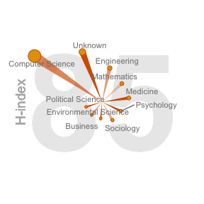
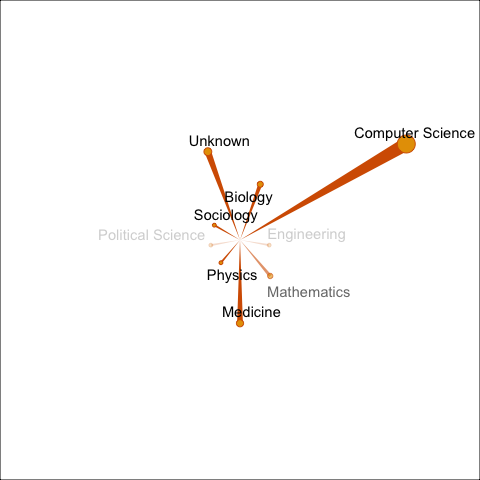

<!-- README.md is generated from README.Rmd. Please edit that file -->

# paper

<!-- badges: start -->

[](https://lifecycle.r-lib.org/articles/stages.html#experimental)
<!-- badges: end -->

The goal of paper is to produce summary of publication profile of a
scientist or a paper.

## Installation

You can install the released version of paper from
[CRAN](https://CRAN.R-project.org) with:

``` r
# install.packages("paper")
# not yet
```

And the development version from [GitHub](https://github.com/) with:

``` r
# install.packages("devtools")
# devtools::install_github("kklot/paper")
library(paper)
```

## Example

This is a basic example which shows you how to solve a common problem:

### Search an author

``` r
ath <- search_author("Van Kinh Nguyen", limit = 10)
#> Found 16 potential matches, listing here the 10 authors
#> use view_web(this_object, authorID) to open the author url in your browser.
#> use get_paper(this_object, authorID) to get a table of publication
#> top ten rows
#> # A tibble: 10 × 5
#>    name            authorId   affiliations url          most_recent_paper       
#>    <chr>           <chr>      <chr>        <chr>        <chr>                   
#>  1 K. Nguyen       144006459  ,            https://www… Influence of maternal u…
#>  2 V. Kinh Nguyen  1398832498 ,            https://www… An Egyptian HPAI H5N1 i…
#>  3 V. Nguyen       2147319167 ,            https://www… 91. Gaps and Opportunit…
#>  4 N. Kính         3620223    ,            https://www… Prevalence of Advanced …
#>  5 N. V. Kinh      7909277    ,            https://www… Fomento de la elaboraci…
#>  6 N. Kinh         52204342   ,            https://www… Evaluate the relationsh…
#>  7 K. Van Nguyen   6786539    ,            https://www… An Expanded HIV Care Ca…
#>  8 N. van Kinh     134536179  ,            https://www… Effectiveness of contin…
#>  9 Kinh Nguyen Van 51926186   ,            https://www… Sofosbuvir-velpatasvir …
#> 10 Van Kinh Nguyen 2147319144 ,            https://www… Within-host evolutionar…
get_paper(ath, ath$essential$authorId[1])
#> # A tibble: 194 × 5
#>    authorId  paperId                                  url        title      year
#>    <chr>     <chr>                                    <chr>      <chr>     <int>
#>  1 144006459 dd9cae6f41971fce1947edd36b811d9bb594d33b https://w… Influenc…  2021
#>  2 144006459 027eef3c5965af13e9c82a6ac8cca601996b74c0 https://w… Validati…  2020
#>  3 144006459 2ec4b632b9e1e2e045c7491d3ad03086e8be00ae https://w… Effect o…  2020
#>  4 144006459 85426b1dedc07183574f27e51e703bab1d880937 https://w… Clinical…  2020
#>  5 144006459 922cf3c0cff912c07281be34bc8170bb30a734ac https://w… Virologi…  2020
#>  6 144006459 95f6d25ef4e08f7852f13c787a91dea9bfaa8225 https://w… Survival…  2020
#>  7 144006459 99b6ed39462e849e25ec261817b13cbfb388f138 https://w… Existenc…  2020
#>  8 144006459 a3067275da01f65c00cb66a49db43111e9cce222 https://w… EPIDEMIO…  2020
#>  9 144006459 c3cb349244c2e5100775d1db8e93b0dff4c54fea https://w… Efficacy…  2020
#> 10 144006459 1e47a1712d433c52eb9b067675aa0ab04d115019 https://w… Cardiova…  2019
#> # … with 184 more rows
```

### Search a paper

-   [ ] TODO - easy

### an_author

Get an author’s papers

``` r
ex_aut <- an_author(level = 'me_only')
summary(ex_aut)
#> hIndex       :85
#> paperCount   :268
#> citationCount:32770
ex_aut
#> # A tibble: 285 × 5
#>    paperId           url                        year citationCount fieldsOfStudy
#>    <chr>             <chr>                     <dbl>         <int> <list>       
#>  1 116c1cf1650648d8… https://www.semanticscho…  2021             0 <chr [1]>    
#>  2 6e5170901d940be6… https://www.semanticscho…  2021             0 <chr [1]>    
#>  3 98eb27ccd9f0875e… https://www.semanticscho…  2021             6 <chr [1]>    
#>  4 a197dc7522800487… https://www.semanticscho…  2019            21 <chr [1]>    
#>  5 e3d5d70005bcc9d3… https://www.semanticscho…  2021             0 <chr [1]>    
#>  6 2eab8dd8db899437… https://www.semanticscho…  2020             0 <chr [1]>    
#>  7 329b30272c884037… https://www.semanticscho…  2019            39 <chr [1]>    
#>  8 4a10dffca6dcce9c… https://www.semanticscho…  2020           379 <chr [1]>    
#>  9 4a10dffca6dcce9c… https://www.semanticscho…  2020           379 <chr [1]>    
#> 10 fb73b93de3734a99… https://www.semanticscho…  2019           194 <chr [1]>    
#> # … with 275 more rows
```

Plot profile of an author

``` r
plot(ex_aut)
```

<div class="figure">


<p class="caption">
My publication profile contribution
</p>

</div>

Author’s paper and papers cited each of those papers. Rate limit does
not allow sending more than 500 requests/minutes.

-   [ ] ask for more once the package is more mature

``` r
# ex_aut2 <- an_author(level = "me_and_cited_me")
# ex_aut2
```

### a_paper

Get all citations to a paper, number of citations to each of those
paper, year, and field of study.

These are related papers.

``` r
ex_paper <- a_paper()
ex_paper
#> # A tibble: 111 × 5
#>    paperId           url                        year citationCount fieldsOfStudy
#>    <chr>             <chr>                     <int>         <dbl> <list>       
#>  1 8dc1e4bac2d0403b… https://www.semanticscho…  2022             0 <chr [1]>    
#>  2 03dc6ccb0b04d5eb… https://www.semanticscho…  2020            24 <chr [1]>    
#>  3 04eb972bda6e775d… https://www.semanticscho…  2021             4 <chr [1]>    
#>  4 0905b384bc98e40c… https://www.semanticscho…  2021             0 <chr [1]>    
#>  5 097bd00d48281dfb… https://www.semanticscho…  2020             2 <chr [1]>    
#>  6 10247d86d6b9ea32… https://www.semanticscho…  2021             4 <chr [1]>    
#>  7 1346d703959399ba… https://www.semanticscho…  2021             0 <chr [1]>    
#>  8 148bca569a0d2833… https://www.semanticscho…  2021             0 <chr [1]>    
#>  9 15e1af8533cd810e… https://www.semanticscho…  2018             4 <chr [1]>    
#> 10 19af8292ff3cc10a… https://www.semanticscho…  2020            44 <chr [1]>    
#> # … with 101 more rows
```

Example citation profile of a single paper. The extra margin is cropped
with `pdfcrop`, see
[document](https://bookdown.org/yihui/rmarkdown-cookbook/crop-plot.html)
here.

``` r
plot(ex_paper)
```

<div class="figure">


<p class="caption">
Profile of all papers that cited this work
</p>

</div>
