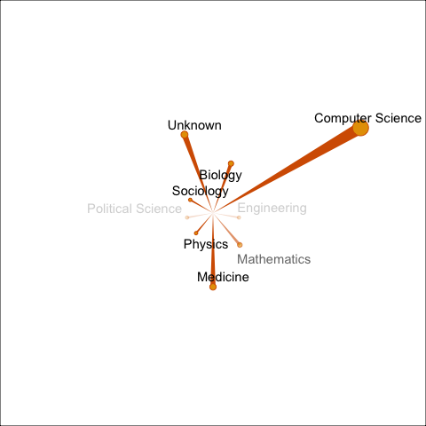

<!-- README.md is generated from README.Rmd. Please edit that file -->

# paper

<!-- badges: start -->
<!-- badges: end -->

The goal of paper is to produce summary of publication profile of a
scientist or a paper.

## Installation

You can install the released version of paper from
[CRAN](https://CRAN.R-project.org) with:

``` r
# install.packages("paper")
# not yet
```

And the development version from [GitHub](https://github.com/) with:

``` r
# install.packages("devtools")
# devtools::install_github("kklot/paper")
library(paper)
```

## Example

This is a basic example which shows you how to solve a common problem:

Get all citations to a paper, number of citations to each of those
paper, year, and field of study.

``` r
ex_paper <- a_paper()
ex_paper
#> # A tibble: 111 × 4
#>    paperId                                   year citationCount fieldsOfStudy
#>    <chr>                                    <int>         <dbl> <list>       
#>  1 8dc1e4bac2d0403ba4bec7bcb8abb7534c53ab1f  2022             0 <chr [1]>    
#>  2 03dc6ccb0b04d5eb6439c33c185bdd1fe892b76e  2020            24 <chr [1]>    
#>  3 04eb972bda6e775d5a15ee49541afca3e3cc93db  2021             4 <chr [1]>    
#>  4 0905b384bc98e40c5a9ca20027f5fab3fbc455b4  2021             0 <chr [1]>    
#>  5 097bd00d48281dfb987cc2277b34f7706c2aa0ef  2020             2 <chr [1]>    
#>  6 10247d86d6b9ea3218d73b1e64ea7ed4b1121752  2021             4 <chr [1]>    
#>  7 1346d703959399ba404f251290d0352f0631d242  2021             0 <chr [1]>    
#>  8 148bca569a0d2833f05df1297788f64bc6686fa8  2021             0 <chr [1]>    
#>  9 15e1af8533cd810e976d36845b53f5f54744608a  2018             4 <chr [1]>    
#> 10 19af8292ff3cc10aad6f190490f0d34691658179  2020            44 <chr [1]>    
#> # … with 101 more rows
```

Example citation profile of a single paper. The extra margin is cropped
with `pdfcrop`, see
[document](https://bookdown.org/yihui/rmarkdown-cookbook/crop-plot.html)
here.

``` r
plot(ex_paper)
```


